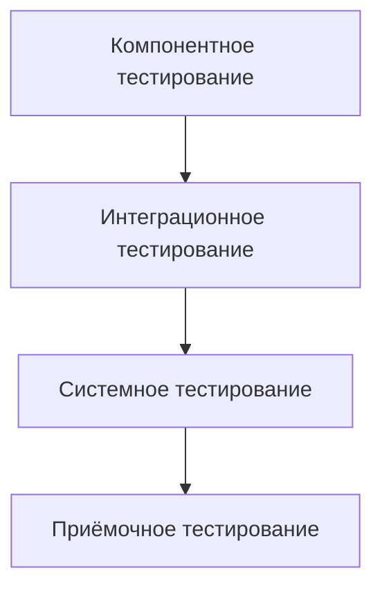

# Тестирование, отладка и интеграция функциональных компонентов

## Введение

Современные программные системы строятся как совокупность функциональных компонентов, взаимодействующих через определённые интерфейсы и контракты. В условиях широкого распространения распределённых и микросервисных архитектур возрастает роль формализованных процессов обеспечения качества, охватывающих не только реализацию, но и проверку, поиск причин дефектов и интеграцию компонентов в целостную систему.

Тестирование, отладка и интеграция функциональных компонентов образуют связанный комплекс процессов. Тестирование обеспечивает выявление расхождений между фактическим и ожидаемым поведением. Отладка позволяет установить причины этих расхождений и внести изменения в реализацию. Интеграция направлена на согласованное функционирование компонентов в составе более крупной системы. Их согласованное использование является необходимым условием надёжности и сопровождаемости программного обеспечения.

## Теоретические основы тестирования, отладки и интеграции

### Теоретические основы тестирования

С точки зрения современных стандартов тестирование рассматривается как систематический процесс планирования, проектирования, выполнения и анализа результатов тестов. Оно ориентировано на снижение рисков, связанных с отказами, а не на доказательство полной корректности программы.

Тестирование функциональных компонентов выполняет несколько ключевых задач:
во-первых, подтверждение того, что компонент реализует заявленные требования; во-вторых, оценка способности компонента корректно обрабатывать ошибочные и граничные входные данные; в-третьих, частичную оценку соответствия нефункциональным требованиям (производительность, устойчивость, безопасность) в пределах данного компонента.

На практике в компонентах задаётся явный или неявный контракт: допустимые входы, ожидаемые выходы, возможные ошибки. Тестирование позволяет убедиться в том, что этот контракт соблюдается в типичных и граничных сценариях.

### Теоретические основы отладки

Отладка определяется как процесс выявления, локализации и устранения причин обнаруженных дефектов. Теоретически её можно представить как итерационный цикл:
обнаружение аномалии → воспроизведение → локализация (анализ состояния, трассировка, сопоставление с требованиями) → модификация кода или конфигурации → повторное тестирование.

В отличие от тестирования, отладка всегда связана с изменением артефактов разработки (кода, конфигураций, сценариев развёртывания). В сложных системах отладка часто сопровождается анализом нескольких источников информации: логов, метрик мониторинга, дампов памяти, сетевых трасс.

### Теоретические основы интеграции

Интеграция компонентов — это процесс объединения модулей, подсистем или сервисов в более крупные единицы, в которых проверяется и обеспечивается согласованность интерфейсов, форматов данных и протоколов взаимодействия.

С теоретической точки зрения интеграция опирается на понятия связности и зацепления компонентов. Чем более явно определены интерфейсы и чем слабее зацепление (меньше скрытых зависимостей), тем проще выполнять поэтапную интеграцию и локализовывать дефекты.

В условиях микросервисной архитектуры интеграция приобретается характер интеграции через сеть: необходимо согласовать версии API, схемы сообщений, политики управления ошибками и временем ожидания, а также учитывать характеристики сети (задержки, частичные отказы).

## Классификации видов тестирования

### Уровни тестирования

Современные подходы выделяют несколько уровней тестирования, соответствующих различным объектам проверки.

| Уровень тестирования     | Основной объект проверки            | Цель                                                                      | Пример из практики                                            |
| ------------------------ | ----------------------------------- | ------------------------------------------------------------------------- | ------------------------------------------------------------- |
| Компонентное (модульное) | Отдельный модуль, класс, функция    | Проверка корректности локальной логики и обработки ошибок                 | Тест функции расчёта итоговой суммы заказа с учётом скидок    |
| Интеграционное           | Набор взаимодействующих компонентов | Выявление дефектов на границах и несогласованности интерфейсов            | Проверка взаимодействия веб-сервиса и слоя доступа к данным   |
| Системное                | Система в целом                     | Проверка выполнения функциональных и основных нефункциональных требований | Тестирование сценария «оформление заказа» в интернет-магазине |
| Приёмочное               | Система с точки зрения пользователя | Подтверждение пригодности системы для эксплуатации                        | Проверка типовых сценариев вместе с представителями заказчика |

На практике для функциональных компонентов наибольшее значение имеют компонентный и интеграционный уровни: первый обеспечивает локальную правильность, второй — корректность взаимодействия с соседними компонентами.

Схема отражает переход от локальной проверки отдельных компонентов к оценке поведения системы в целом и с точки зрения конечного пользователя.

### Классификация по доступу к внутренней структуре

С точки зрения доступности внутренней реализации традиционно выделяют три группы методов:

| Тип подхода                | Характеристика                                                                           | Пример из практики                                                 |
| -------------------------- | ---------------------------------------------------------------------------------------- | ------------------------------------------------------------------ |
| Тестирование чёрного ящика | Ориентировано на спецификацию и внешнее поведение, внутренняя структура не анализируется | Проверка API сервиса по контракту без знания внутренней реализации |
| Тестирование белого ящика  | Ориентируется на структуру кода, ветвления, условия, пути                                | Тестирование всех ветвей сложного алгоритма расчёта тарифов        |
| Тестирование серого ящика  | Частично учитывает внутреннюю структуру (архитектуру, ключевые состояния)                | Тестирование кэширующего слоя с учётом стратегий инвалидации       |

Такое разделение важно при выборе методик проектирования тестов: для чёрного ящика применимы техники анализа спецификаций, для белого — техники покрытия кода, для серого — комбинированный подход.

### Классификация по целям тестирования

По целям и фокусу проверки можно выделить следующие группы тестов компонентов и их интеграции:

* функциональные тесты, ориентированные на проверку реализации требований (корректность вход–выход, обработка ошибок);
* нефункциональные тесты (производительность, надёжность, безопасность, удобство использования);
* регрессионные тесты, направленные на проверку того, что внесённые изменения не нарушили уже работающую функциональность.

В реальных проектах регрессионное тестирование часто автоматизируется в виде набора компонентных и интеграционных тестов, запускаемых при каждом изменении кода в контексте непрерывной интеграции.

## Методы отладки

### Интерактивная (пошаговая) отладка

Интерактивная отладка с использованием дебаггера позволяет выполнять программу пошагово, устанавливать точки останова, исследовать значения переменных и стек вызовов.

На практике этот метод эффективен при исследовании логических ошибок, возникающих в сложных ветвлениях или циклах, а также при анализе несоответствия фактической последовательности вызовов ожидаемой архитектуре.

### Отладка на основе логирования и трассировки

Логирование представляет собой систематическое протоколирование существенных событий: входных параметров, промежуточных результатов, ошибок, исключений, технических метрик.

В распределённых и микросервисных системах широко применяется централизованное логирование и трассировка запросов, позволяющие отслеживать путь запроса через несколько сервисов. В реальных проектах это часто единственный практический способ отладки проблем, проявляющихся только в продуктивной среде под реальной нагрузкой.

### Профилирование и мониторинг

Профилирование ориентировано на выявление узких мест по времени выполнения, использованию процессорного времени и памяти. Мониторинг предоставляет агрегированные метрики (время отклика, частота ошибок, использование ресурсов), позволяющие обнаруживать аномалии.

Например, в реальном веб-приложении профилирование может показать, что основное время обработки запроса тратится не на бизнес-логику, а на многократные обращения к базе данных, что приводит к решению изменить стратегию кэширования или оптимизировать запросы.

### Анализ дампов и постмортем-отладка

При критических сбоях (падении процесса, взаимной блокировке, повреждении памяти) полезным становится анализ дампов памяти или снимков состояния процесса. Постмортем-отладка позволяет исследовать состояние системы в момент отказа, даже если проблема трудно воспроизводима.

В высоконагруженных системах такой подход особенно ценен, поскольку остановка среды для традиционной интерактивной отладки может быть недопустима.

## Подходы к интеграции

### Архитектурные аспекты интеграции

Интеграция компонентов зависит от архитектурного стиля. В монолитных системах она чаще всего реализуется через вызовы модулей внутри одного процесса. В распределённых и микросервисных архитектурах доминируют взаимодействия по сети, обмен сообщениями, использование очередей и шины данных.

Во всех случаях интеграция предполагает согласование: интерфейсов (сигнатур методов, контрактов API), форматов данных (схем JSON, XML, бинарных протоколов), соглашений об обработке ошибок и временных ограничений.

### Стратегии интеграционного тестирования

Различные стратегии интеграции компонентов связаны с порядком их объединения:

| Стратегия            | Краткая характеристика                                                         | Плюсы                                      | Минусы                                               |
| -------------------- | ------------------------------------------------------------------------------ | ------------------------------------------ | ---------------------------------------------------- |
| Сверху вниз          | Сначала интегрируются высокоуровневые компоненты, нижние заменяются заглушками | Раннее тестирование логики верхнего уровня | Необходимость разработки заглушек для нижнего уровня |
| Снизу вверх          | Сначала объединяются низкоуровневые компоненты, затем более высокие            | Ранняя проверка базовой инфраструктуры     | Логика верхнего уровня проверяется поздно            |
| Смешанная (Sandwich) | Комбинация подходов сверху вниз и снизу вверх                                  | Баланс проверок разных уровней             | Более сложное планирование интеграции                |
| Полная (Big Bang)    | Одновременная интеграция всех компонентов                                      | Быстрое получение целостной системы        | Трудности локализации дефектов и высокий риск сбоев  |

В реальных проектах предпочтение обычно отдаётся поэтапной (инкрементальной) интеграции, поскольку она лучше поддерживает локализацию дефектов и вписывается в практики непрерывной интеграции.

### Интеграция в контексте CI/CD

В условиях непрерывной интеграции и поставки типичный конвейер включает автоматизированную сборку, выполнение наборов модульных и интеграционных тестов, анализ качества кода и развёртывание на тестовые или промежуточные среды.

На практике это означает, что значительная часть интеграционных проверок выполняется автоматически: при каждом изменении в репозитории запускаются тесты, проверяющие как отдельные компоненты, так и их ключевые взаимодействия.

### Интеграционные контракты и API

Для интеграции через API важны явно определённые контракты: спецификации REST-интерфейсов, схемы сообщений, описания ошибок. На основе таких контрактов возможна реализация контрактного тестирования, при котором автоматические тесты проверяют, что реализация сервиса соответствует опубликованной спецификации.

В реальных системах это позволяет независимо развивать клиентские и серверные компоненты, снижая риск дефектов, возникающих из-за незаметных изменений интерфейсов.

## Тестирование интегрированной системы

### Системное и системно-интеграционное тестирование

Системное тестирование направлено на проверку всей системы как целого в условиях, максимально приближенных к эксплуатационным. В рамках системного тестирования рассматриваются функциональные сценарии, кросс-компонентные взаимодействия и ключевые нефункциональные характеристики (производительность, надёжность, безопасность).

Системно-интеграционное тестирование дополняет его фокусом на взаимодействии с внешними системами и окружением: платёжными шлюзами, сторонними сервисами, устройствами, внешними базами данных.

### End-to-end тестирование

End-to-end тестирование ориентировано на проверку бизнес-процессов от начального события до конечного результата. В отличие от компонентных и интеграционных тестов, оно рассматривает систему с точки зрения пользователя или внешней системы.

На практике типичным примером является проверка сценария «пользователь оформляет заказ»: от регистрации и выбора товара до оплаты и получения подтверждения. Такой сценарий затрагивает множество компонентов одновременно (интерфейс, бизнес-логику, интеграцию с платёжными сервисами, систему уведомлений), что делает end-to-end тесты важным дополнением к компонентным и интеграционным проверкам.

### Нефункциональное тестирование интегрированной системы

Для интегрированной системы особое значение имеют следующие виды нефункционального тестирования:

* нагрузочное тестирование (оценка поведения при типичной и повышенной нагрузке);
* стресс-тестирование (исследование поведения за пределами расчётных характеристик);
* тестирование отказоустойчивости (реакция на отказы компонентов, сетевые проблемы, недоступность внешних сервисов);
* тестирование безопасности (анализ уязвимостей во взаимодействиях, проверка управления доступом и шифрования).

Эти виды проверок позволяют оценить поведение системы не только в «идеальных», но и в реальных эксплуатационных условиях с учётом сбоев и атак.

## Практические рекомендации

### Рекомендации по организации тестирования

Целесообразно выстраивать процессы тестирования в соответствии с требованиями и рисками: для критичных функций обеспечивать более высокую глубину и ширину проверок. Практически полезны следующие принципы:

во-первых, прослеживаемость требований до тестовых случаев (traceability), позволяющая контролировать полноту покрытия; во-вторых, использование риск-ориентированного подхода, при котором усилия по тестированию распределяются в пользу наиболее важных и уязвимых частей системы; в-третьих, максимальная автоматизация повторяемых тестов, прежде всего модульных и интеграционных.

### Рекомендации по отладке

Для повышения эффективности отладки рекомендуется проектировать систему с учётом её диагностики: вводить структурированное логирование, уникальные идентификаторы запросов, метрики времени отклика и частоты ошибок. Это существенно упрощает анализ проблем в интегрированной среде.

Кроме того, полезно формализовать процесс обработки инцидентов: фиксировать сценарий возникновения дефекта, шаги воспроизведения, результаты анализа и принятые решения. Это повышает воспроизводимость отладки и облегчит обучение новых участников команды.

### Рекомендации по интеграции

При проектировании интеграции следует стремиться к слабой связанности и чётким контрактам. Практически это означает:

* использование явных спецификаций API и схем данных;
* строгий контроль версионности интерфейсов и обратной совместимости;
* разделение окружений (разработка, тестирование, предварительная эксплуатация, продуктивная среда) с контролируемыми процессами промоции изменений между ними;
* включение интеграционных и контрактных тестов в конвейер непрерывной интеграции.

Для сложных систем целесообразно вводить стандарты интеграции внутри организации (единые форматы ошибок, общие требования к аутентификации и авторизации, общие библиотеки клиентов).

## Заключение

Тестирование, отладка и интеграция функциональных компонентов образуют взаимосвязанный комплекс процессов, определяющих качество программного обеспечения на уровне как отдельных модулей, так и системы в целом. Теоретические основы тестирования опираются на формализованные стандарты и методики, но эффективность на практике достигается только при их систематическом и дисциплинированном применении.

Отладка, будучи неотделимой от тестирования, обеспечивает переход от обнаружения дефектов к их устранению и совершенствованию реализации. Интеграция, в свою очередь, переводит фокус с изолированных компонентов на их взаимодействие в реальной архитектуре, что особенно важно для современных распределённых и микросервисных систем.

Сочетание формальных подходов (стандарты тестирования, процессные модели, архитектурные принципы) с практическими инструментами (автоматизированные тесты, дебаггеры, системы логирования и мониторинга, конвейеры CI/CD) позволяет создавать и сопровождать программные системы, удовлетворяющие высоким требованиям к надёжности, производительности и безопасности.